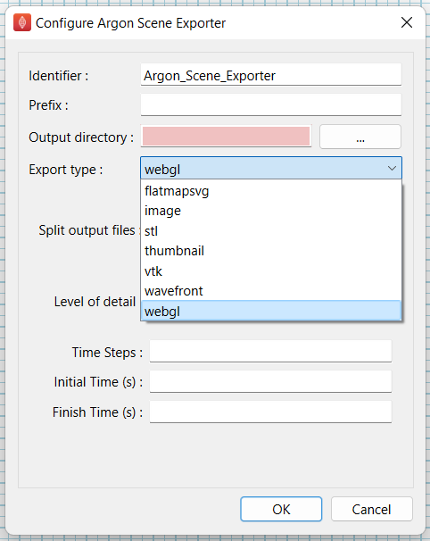
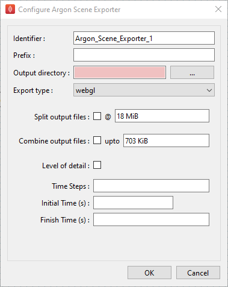

Argon Scene Exporter
====================

Overview
--------

The **Argon Scene Exporter** is a MAP Client plugin for exporting an Argon scene.
The plugin uses an Argon document as an input.
The plugin can be configured to export the scene to either webGL or a JPEG thumbnail.

Specification
-------------

Information on this plugins' specification is available :ref:`here <mcp-argonsceneexporter-specification>`.

Configuration
-------------

As a minimum, to configure the step, set the name of the step, select the export type required, and set the output directory.
The output directory should be located outside the workflow directory.

.. _fig-mcp-argon-scene-exporter-list-dialog:

   Argon scene exporter step configuration dialog showing various export types.

There is one parameter for configuring the step that is optional.
The optional parameter is the *prefix* parameter.
It is however a good idea to set the *prefix*, the *prefix* is used in formulating the output filename.

There are also parameters that are dependent on the exporter chosen.

.. _fig-mcp-argon-scene-exporter-configure-dialog:

   Argon scene exporter step configuration dialog for *webGL* exporter.

The *webGL* exporter also has the following optional parameters:

#. Split output files
#. Level of detail
#. Time Steps
#. Initial Time
#. Finish Time

The *image* exporter has the following optional parameters:

#. Width, [min. 18, max. 9999]
#. Height, [min. 18, max. 9999]

The *flatmapsvg*, *stl*, *thumbnail*, *vtk* and *wavefront* exporter do not have any optional parameters.

The *Prefix* parameter, is a string that is placed as a prefix on all files produced by the type of export selected.

The *Time Steps* parameter, is an integer representing the number of time steps to output the export at between the *Initial Time* and the *Finish Time*.
The *Time Steps* parameter, is currently ignored for the *thumbnail* export, the intention is to output a GIF image in the future.
The *Initial Time* parameter, is the initial time to export the scene from.
The *Finish Time* parameter, is the final time to export the scene to.
The *Time Steps*, *Initial Time*, and *Finish Time* are only appropriate for time varying scenes.
If the scene is not time varying these parameters are ignored.

The *Split output files* and associated file size, allows a big output file to be split into multiple smaller files when
checked and the split files are limited by the specified memory size.
The *Level of detail*, when checked, allows generation of webGL exports that provide higher level of details with zoom.

The *Width* parameter, is an integer that sets the width of the exported image.
The *Height* parameter, is an integer that sets the height of the exported image.

Instructions
------------

This is a non-interactive step.
See `Configuration`_.
