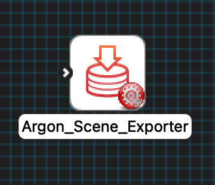

MAP Client Plugin - Argon Scene Exporter
========================================

The **Argon Scene Exporter** is a MAP Client plugin for exporting an Argon scene.
The plugin uses an Argon document (step uses port definition: https://opencmiss.org/1.0/rdf-schema#ArgonDocument) as an input.
The plugin can be configured to export the scene to either webGL or a JPEG thumbnail.

.. _fig-mcp-argon-scene-exporter-un-configured-step:

   An un-configured Argon scene exporter step.

Configure
---------

As a minimum, to configure the step, set the name of the step, select the export type required, and set the output directory.
The output directory should be located outside the workflow directory.

.. _fig-mcp-argon-scene-exporter-configure-dialog:

.. figure:: _images/step-configuration-dialog.png
   :alt: Step configure dialog

   Argon scene exporter step configuration dialog.

There are four other parameters for configuring the step that are optional:

#. Prefix
#. Time Steps
#. Initial Time
#. Finish Time

The *Prefix* parameter, is a string that is placed as a prefix on all files produced by the type of export selected.
The *Time Steps* parameter, is an integer representing the number of time steps to output the export at between the *Initial Time* and the *Finish Time*.
The *Time Steps* parameter, is currently ignored for the *thumbnail* export, the intention is to output a GIF image in the future.
The *Initial Time* parameter, is the initial time to export the scene from.
The *Finish Time* parameter, is the final time to export the scene to.

The *Time Steps*, *Initial Time*, and *Finish Time* are only appropriate for time varying scenes.
If the scene is not time varying these parameters are ignored.
